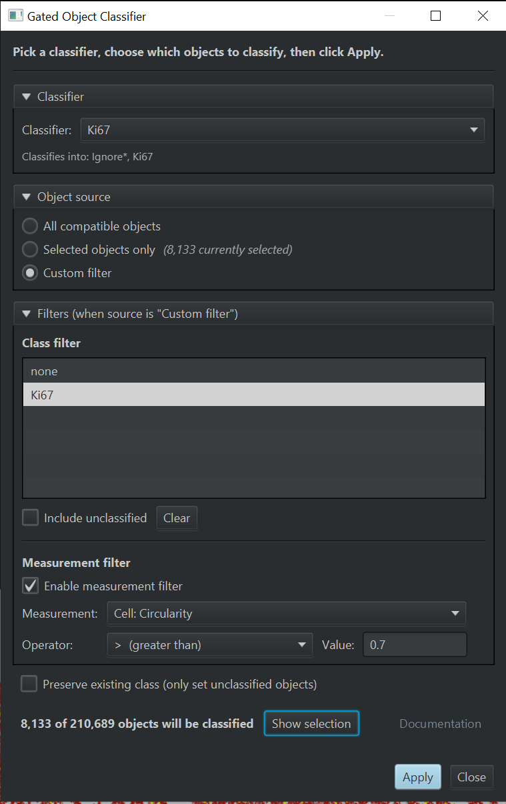

# QuPath Extension: Gated Object Classifier

Apply a saved [QuPath](https://qupath.github.io/) object classifier to a *gated*
subset of objects rather than to every compatible object in the image.

You define the subset by class membership, by measurement value, or from
the current viewer selection - and any combination of the above. Each
application is recorded as a copyable workflow step so you can run the
same operation on a whole project as a script.

This pattern was originally explored in
[Sara McArdle's `B_Helper_Cyto.groovy`](https://github.com/saramcardle/Image-Analysis-Scripts/blob/master/QuPath%20Groovy%20Scripts/Workshop%20Examples/B_Helper_Cyto.groovy)
and discussed in
[this image.sc forum thread](https://forum.image.sc/t/feature-request-apply-classifiers-to-only-some-selected-objects/86383).



---

## Install

1. Download the extension JAR from the
   [Releases page](https://github.com/uw-loci/qupath-extension-gated-object-classifier/releases).
2. Drag the JAR into a running QuPath window. QuPath will offer to copy it
   into your extensions folder; accept.
3. Restart QuPath.

The extension appears under `Extensions > Gated Object Classifier`.

**Requires:** QuPath 0.6.0 or later.

---

<details>
<summary><b>Why use this?</b></summary>

QuPath's stock "Object classification > Apply classifier" command always runs
on every compatible object in the image. That makes it awkward to:

- Stack two classifiers, where the second one should only run on the cells
  the first one left unclassified.
- Pre-filter a noisy image - apply a strong-marker classifier only to cells
  whose intensity already passes a threshold.
- Quickly iterate on a small ROI by classifying just the objects you have
  selected in the viewer.

This extension adds a single dialog that lets you define the subset
declaratively, with a live preview of how many objects are about to be
classified.

</details>

<details>
<summary><b>How to use it</b></summary>

1. Open a project and the image you want to classify. Make sure the project
   has at least one saved object classifier
   (`Classify > Object classification > Train object classifier`).
2. Open `Extensions > Gated Object Classifier > Apply Gated Classification...`.
3. Pick a classifier from the dropdown. The dialog shows which classes the
   classifier outputs.
4. Choose an object source:
   - **All compatible objects** - whatever the classifier reports as
     compatible with the current image.
   - **Selected objects only** - the current viewer selection, intersected
     with the compatible set.
   - **Custom filter** - applies the class and measurement filters below.
5. (Custom filter only) narrow the set:
   - **Class filter** - pick one or more classes from the list. Tick
     `Include unclassified` to also include objects with no class.
   - **Measurement filter** - pick a measurement, an operator
     (`<`, `<=`, `>`, `>=`, `==`, `!=`, `between`), and one (or two)
     threshold values.
6. Watch the preview - `X of Y objects will be classified` updates live.
   Click `Show selection` to highlight the gated objects in the viewer.
7. (Optional) tick `Preserve existing class` to leave already-classified
   objects untouched (this passes `resetExistingClass = false` to QuPath's
   classifier).
8. Click `Apply`. The classifier runs on the gated subset, the hierarchy
   refreshes, and a workflow step named `Apply gated object classifier`
   is appended to the image's workflow history.

**Keyboard shortcuts in the dialog**

- `Enter` -> Apply
- `Esc` -> Close

</details>

<details>
<summary><b>Workflow / scripting</b></summary>

Each time you click Apply, QuPath records the operation as a reusable step
so you can batch the same classification across an entire project later.

After you Apply, open the **Workflow** tab in QuPath and you will see a step
called `Apply gated object classifier`. Right-click it and choose
`Create workflow` (or `Create script`) to get a runnable Groovy snippet,
which you can run on every image in the project via `Run > Run for project`.

### Examples

**All compatible objects** (no filter, just classifies what the classifier
considers compatible):

```groovy
import qupath.ext.gatedobjclassifier.scripting.GatedObjectClassifierScripts

GatedObjectClassifierScripts.runGatedClassifier(
    "MyClassifier",
    [source: "ALL_COMPATIBLE"]
)
```

**Selected objects only** (script reads the current selection at run time):

```groovy
GatedObjectClassifierScripts.runGatedClassifier(
    "MyClassifier",
    [source: "SELECTED_ONLY"]
)
```

**Custom filter** combining class membership and a measurement threshold:

```groovy
GatedObjectClassifierScripts.runGatedClassifier(
    "T-cell-classifier",
    [
        source        : "CUSTOM",
        classes       : [["Tumor"], ["Stroma"], "(unclassified)"],
        measurement   : "DAB: Cell: Mean",
        op            : "LT",
        value1        : 0.25,
        preserveClass : false
    ]
)
```

**Recreating the `B_Helper_Cyto.groovy` pattern** (apply classifier B only
to what classifier A left unclassified):

```groovy
runObjectClassifier("CD20")  // classifier A - QuPath built-in script API

GatedObjectClassifierScripts.runGatedClassifier(
    "CD4_CD8",  // classifier B
    [
        source : "CUSTOM",
        classes: ["(unclassified)"]
    ]
)
```

### Recognised options

| Key            | Type                | Notes                                                                 |
|----------------|---------------------|-----------------------------------------------------------------------|
| `source`       | `String`            | `"ALL_COMPATIBLE"`, `"SELECTED_ONLY"`, `"CUSTOM"` (required).         |
| `classes`      | `List`              | CUSTOM only. Each entry is either a `List<String>` of component names (recommended; reconstructed via `PathClass.fromCollection`, so colons in derived class chains round-trip safely) or a plain `String` (parsed via `PathClass.fromString`). Use `"(unclassified)"` for null-class. |
| `measurement`  | `String`            | CUSTOM only. Measurement name as it appears in the measurement table. |
| `op`           | `String`            | One of `LT, LE, GT, GE, EQ, NE, BETWEEN`.                             |
| `value1`       | `Number`            | Primary threshold.                                                    |
| `value2`       | `Number`            | Required only when `op == "BETWEEN"`.                                 |
| `preserveClass`| `Boolean`           | `true` skips overwriting objects that already have a class.           |

Unknown keys are ignored. Missing required keys default to a no-op
(logged as a warning).

</details>

<details>
<summary><b>Behaviour notes</b></summary>

A few things worth knowing once you start using the extension day-to-day:

- **Repeated Apply records repeated workflow steps.** Each click of Apply
  appends a new step to the image's workflow history. That's intentional
  - it preserves the order of operations - but if you only want one
  step, only click Apply once per logical change.
- **Workflow steps reference the classifier by name.** If you retrain or
  rename the classifier later, re-running the recorded script will use
  the *current* classifier with that name, not the one that was active
  when the step was recorded. Save a renamed copy if you need to pin a
  specific version.
- **Undo + workflow history.** QuPath's `Edit > Undo` reverses the
  classification but does **not** remove the recorded workflow step.
  If you undo and don't want the step to re-fire, delete it manually
  from the Workflow tab.
- **`SELECTED_ONLY` is a no-op in batch.** When the recorded script
  runs via `Run > Run for project`, there is no interactive selection,
  so `source: "SELECTED_ONLY"` will classify nothing. The extension
  logs a warning naming the image when this happens.
- **Switching images closes the dialog.** If you change the active
  image while the dialog is open, the dialog closes itself - this
  prevents accidental Apply against the wrong image's hierarchy.
- **The dialog stays in sync with the hierarchy.** Run a new cell
  detection, apply another classifier, or reset classifications while
  the dialog is open and the universe / class list / measurement list
  refresh automatically.
- **Reserved class name `(unclassified)`.** This exact string is used
  by the recorded scripts to mean "objects without a class". If your
  project genuinely has a class literally named `(unclassified)` it
  will be matched as the null-class sentinel rather than that named
  class - rename it.
- **Multi-part class names round-trip intact.** Each selected class is
  recorded as a list of its component names (e.g. `["Tumor", "Positive"]`
  for `Tumor: Positive`) and reconstructed via `PathClass.fromCollection`,
  so the colon used by QuPath as a parent/child separator never
  ambiguates a re-run. Plain-string entries from hand-edited scripts are
  still accepted and parsed via `PathClass.fromString`.

</details>

<details>
<summary><b>Limitations (v0.1)</b></summary>

- **Project-saved classifiers only.** Loading classifiers from a file path
  outside the project is not yet exposed in the GUI; you can still do it by
  hand from a Groovy script with `loadObjectClassifier("/full/path.json")`.
- **Single classifier per run.** Running several classifiers sequentially
  (composite classifier) requires multiple workflow steps, one per call.
- **AND-only logic between filters.** Class filter and measurement filter
  are combined with AND. There is no OR or NOT.
- **Last-used filters are not persisted** between sessions.

These are tracked for follow-up; please file a GitHub issue if you need any
of them sooner.

</details>

<details>
<summary><b>Build from source</b></summary>

```bash
git clone https://github.com/uw-loci/qupath-extension-gated-object-classifier
cd qupath-extension-gated-object-classifier
./gradlew shadowJar
# JAR appears under build/libs/
```

Requires JDK 21 (set `JAVA_HOME` or pass
`-Dorg.gradle.java.home=/path/to/jdk21` if your default JDK is newer).

Run unit tests with `./gradlew test`. The tests are pure Java and do not
require a running QuPath instance.

</details>

<details>
<summary><b>Contributing</b></summary>

Bug reports and feature requests welcome via
[GitHub Issues](https://github.com/uw-loci/qupath-extension-gated-object-classifier/issues).
Pull requests are also welcome - please open an issue first if you are
planning a substantial change so we can discuss scope.

To refresh the dialog screenshot:

1. Open a real image in QuPath inside a project that has at least one
   saved object classifier.
2. Open `Extensions > Gated Object Classifier > Apply Gated Classification...`
   and arrange a representative configuration.
3. Capture the dialog (e.g. with the OS screenshot tool).
4. Save the image as `docs/screenshot-dialog.png` in this repository.

</details>

---

## License

Apache License 2.0. Copyright 2026 Regents of the University of
Wisconsin-Madison. See [LICENSE](LICENSE).
